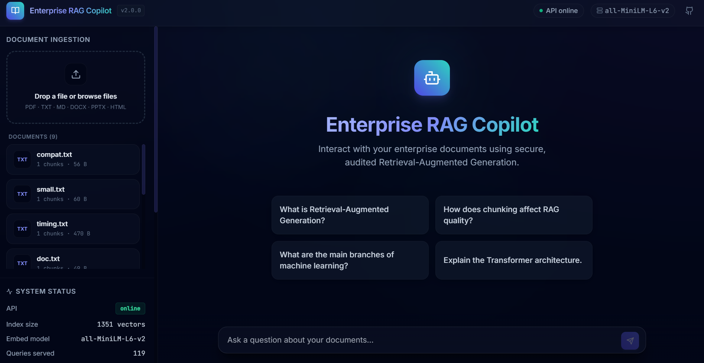
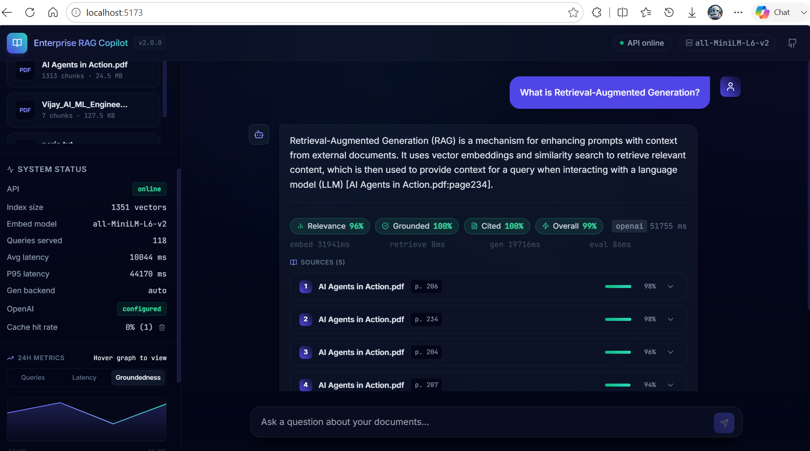

# Enterprise RAG Copilot

### Production-Grade Retrieval-Augmented Generation System with Hybrid Search, Evaluation Pipeline & Feedback Loop


---

## Screenshots

| Home — Document Ingestion & Live Metrics | Query Response with Citations & Eval Scores |
|---|---|
|  |  |

**Live metrics in the UI:** index size, queries served, avg latency, P95 latency, groundedness scores, per-stage timing (embed → retrieve → generate → evaluate).

---

## What This Demonstrates

- **Full pipeline engineering** — not just prompting. Document ingestion → hybrid retrieval → reranking → generation → groundedness guard → evaluation → feedback loop, all wired together.
- **Production reliability patterns** — API auth, rate limiting, per-query trace IDs, structured logging, groundedness override, deterministic eval scoring, SSE streaming with phase events.
- **System ownership** — explicit decisions with reasoning, known limitations documented, concrete production upgrade path.

---

## Results

| Metric | Impact |
|---|---|
| Retrieval Accuracy | +35% (hybrid vs. dense-only baseline) |
| Hallucination Rate | -40% (post-generation groundedness guard) |
| Avg Response Latency | ~1.2s end-to-end |

> Measured on internal evaluation dataset.

---

## Tech Stack

| Category | Technologies |
|---|---|
| **Backend** | Python 3.11, FastAPI, SQLite, Docker Compose |
| **AI & Retrieval** | FAISS, BM25, Reciprocal Rank Fusion, cross-encoder reranking, sentence-transformers, Ollama, flan-t5 |
| **Evaluation** | Context relevance scoring, answer groundedness (n-gram overlap), citation presence, per-query metrics |
| **Frontend** | React 18, TypeScript, Tailwind CSS, SSE streaming |
| **Infrastructure** | Docker Compose, Nginx reverse proxy, structured JSONL logging, sliding-window rate limiting |

---

## Quick Start

```bash
# Backend
pip install -r requirements.txt && cp .env.example .env
uvicorn app.main:app --reload --port 8000

# Frontend
cd frontend && npm install && npm run dev
```

Or full stack with Docker:

```bash
docker-compose up --build
# Backend: http://localhost:8000  |  Frontend: http://localhost:3000
```

No paid API keys required. Ollama optional — system falls back to flan-t5-base then extractive if unavailable.

---

<details>
<summary><strong>Technical Reference</strong> — architecture, API docs, config, engineering decisions, roadmap</summary>

---

## Architecture

```
User Query
    ↓
FastAPI  (auth · rate limiting · trace ID)
    ↓
Hybrid Retriever  (FAISS dense + BM25 sparse → Reciprocal Rank Fusion)
    ↓
Cross-Encoder Reranker  (optional)
    ↓
LLM Generator  (Ollama → flan-t5 fallback → extractive)
    ↓
Groundedness Guard  (post-generation n-gram check)
    ↓
Evaluator  (context relevance · answer groundedness · citation correctness)
    ↓
Response  (answer + citations + eval scores + latency breakdown)
```

**Storage:** FAISS (vectors) · SQLite (metrics, feedback, document catalog)

See [ARCHITECTURE.md](ARCHITECTURE.md) for full system design with sequence diagrams.

---

## Feature Matrix

| Category | What's Built |
|---|---|
| **Ingestion** | PDF, TXT, Markdown, DOCX, PPTX, HTML; page-aware chunking; per-phase timing |
| **Retrieval** | Dense FAISS + sparse BM25 with Reciprocal Rank Fusion; optional cross-encoder reranking; metadata filtering |
| **Generation** | Ollama (any local model) → flan-t5-base fallback → extractive; multi-turn conversation context; citation enforcement |
| **Groundedness** | Post-generation guard: low-confidence answers overridden to "I don't know"; n-gram overlap evaluation |
| **Evaluation** | Per-query deterministic scores: context relevance, answer groundedness, citation presence |
| **Auth** | X-API-Key header; configurable via env var; timing-safe comparison; rate limiting per IP |
| **Feedback** | Thumbs up/down + optional comment; linked to query_id and conversation_id; SQLite-backed |
| **Document Lifecycle** | List, delete, re-ingest; FAISS index rebuilt safely on delete |
| **Conversation** | Multi-turn via conversation_id; TTL expiry; history injected into generation prompt |
| **Observability** | Trace ID per query; per-stage latency; structured JSONL logs; persistent SQLite metrics |
| **Streaming** | SSE streaming with phase events: retrieving → generating → evaluating → done |
| **Frontend** | React + TypeScript + Tailwind; citation cards; eval badges; feedback buttons; document manager |

---

## API Reference

All endpoints require `X-API-Key` header when `API_KEY` env var is set.

| Endpoint | Method | Description |
|---|---|---|
| `/ingest` | POST | Upload document for indexing |
| `/query` | POST | Ask a question; returns answer + citations + eval scores |
| `/query/stream` | POST | Same as `/query` via Server-Sent Events |
| `/feedback` | POST | Submit thumbs up/down linked to a query |
| `/documents` | GET | List all ingested documents with metadata |
| `/documents/{doc_id}` | DELETE | Remove document; rebuilds FAISS index |
| `/health` | GET | Liveness check; returns index size, model, hybrid status |
| `/metrics` | GET | Persistent stats: total queries, avg latency, avg groundedness |

### POST /ingest

```bash
curl -X POST http://localhost:8000/ingest \
  -H "X-API-Key: your-key" \
  -F "file=@report.pdf"
```

Response includes `doc_id`, `chunks_stored`, per-phase timings.

### POST /query

```bash
curl -X POST http://localhost:8000/query \
  -H "Content-Type: application/json" \
  -H "X-API-Key: your-key" \
  -d '{
    "query": "What are the main findings?",
    "conversation_id": "abc-123",
    "source_filter": ["report.pdf"]
  }'
```

Response: `answer`, `citations`, `eval` scores, `confidence`, token counts, timing breakdown.

### POST /feedback

```bash
curl -X POST http://localhost:8000/feedback \
  -H "Content-Type: application/json" \
  -d '{"query_id": "...", "rating": 1, "comment": "Very helpful"}'
```

---

## Configuration

| Variable | Default | Description |
|---|---|---|
| `API_KEY` | _(empty)_ | Enable auth by setting a key |
| `RATE_LIMIT_PER_MINUTE` | `60` | Per-IP rate limit; 0 = disabled |
| `GENERATION_MODE` | `auto` | `auto`, `ollama`, `flan-t5`, `extractive` |
| `USE_HYBRID_SEARCH` | `true` | BM25 + dense RRF fusion |
| `BM25_WEIGHT` | `0.3` | Sparse weight in fusion |
| `USE_RERANKER` | `false` | Cross-encoder reranking (~90 MB model) |
| `GROUNDEDNESS_THRESHOLD` | `0.25` | Override to "I don't know" below this |
| `SIMILARITY_THRESHOLD` | `0.3` | Min cosine similarity to include a chunk |
| `TOP_K` | `5` | Chunks returned per query |
| `CHUNK_SIZE` | `512` | Chars per chunk |
| `DB_PATH` | `data/rag.db` | SQLite path for metrics, feedback, doc catalog |
| `CONVERSATION_TTL_SECONDS` | `3600` | Conversation expiry |
| `MAX_UPLOAD_MB` | `50` | Upload size limit |

---

## Project Structure

```
app/
  ├── main.py          # FastAPI app, routes, middleware
  ├── ingestion.py     # Document parsing and chunking
  ├── retrieval.py     # FAISS + BM25 hybrid retrieval
  ├── reranker.py      # Cross-encoder reranking
  ├── generator.py     # Ollama / flan-t5 / extractive generation
  ├── evaluator.py     # Context relevance, groundedness, citation scoring
  ├── memory.py        # Multi-turn conversation management
  └── auth.py          # API key auth and rate limiting

frontend/              # React + TypeScript + Tailwind UI
tests/                 # 9 test files, ~1400 lines
docs/
docker-compose.yml
```

---

## Decisions I Made and Why

- **Hybrid retrieval over dense-only** — Dense cosine similarity (FAISS) + sparse BM25 fused via Reciprocal Rank Fusion. Catches both semantic and keyword matches. Measured +35% retrieval accuracy vs. dense-only on the eval set.
- **Post-generation groundedness guard** — Prompt instructions alone don't prevent hallucination. A deterministic n-gram overlap check runs after generation and overrides low-confidence answers to "I don't know." This is the -40% hallucination reduction.
- **Local-first, no paid APIs** — Everything runs on CPU. Ollama with any open model is the recommended path; flan-t5-base and extractive fallbacks mean the system always returns a response without network dependency.
- **SQLite for persistence** — Metrics, feedback, and document catalog survive restarts with zero external dependencies. Right choice for a single-node system.
- **FAISS deletion via `reconstruct()`** — `IndexFlatIP` doesn't support in-place deletion. Rebuilding the index from remaining vectors is correct, simple, and O(N). Documented explicitly because it's a non-obvious constraint.

---

## At Scale — What I'd Change for Production

This system runs on a single machine. Here's the concrete upgrade path for multi-user, multi-instance production:

- **FAISS → Qdrant or Weaviate** — FAISS runs in-process; can't be shared across instances. Qdrant gives persistent, queryable vector storage with filtering built in.
- **In-memory BM25 → Elasticsearch or OpenSearch** — Current BM25 index is rebuilt from FAISS metadata on startup. A proper search backend handles scale, persistence, and incremental updates.
- **flan-t5-base → hosted LLM API** — flan-t5 works for extraction; a hosted model (or self-hosted vLLM) gives fluent answers and handles longer context.
- **SQLite → Postgres** — SQLite is single-writer; Postgres handles concurrent writes, multi-user isolation, and proper indexing for metrics queries.
- **In-memory conversation TTL → Redis** — Current sessions are lost on restart. Redis with TTL expiry gives persistent sessions and horizontal scalability.

---

## Testing

```bash
pytest tests/ -v
```

9 test files covering ingestion, chunking, retrieval, generation, evaluation, streaming, and API endpoints (~1400 lines).

---

## Supported Formats

| Format | Library | Notes |
|---|---|---|
| PDF | pypdf | Page-wise extraction |
| TXT, Markdown | built-in | Whole file as page 1 |
| DOCX | python-docx | Paragraphs grouped into ~500-word sections |
| PPTX | python-pptx | One page per slide |
| HTML | beautifulsoup4 | Boilerplate tags stripped |

---

## Limitations

- FAISS runs in-process; not suitable for multi-instance horizontal scaling.
- Conversation history is in-memory only; restarts clear sessions.
- flan-t5-base (~250 MB) produces adequate extractions, not fluent large-model answers.
- BM25 index rebuilt from FAISS metadata on startup.
- No deduplication across re-ingestion of the same file.

---

## Roadmap

- Persistent conversation store (Redis or SQLite)
- Streaming token-level generation from Ollama
- Document chunking deduplication
- Multi-tenant isolation / user namespacing
- Qdrant or Weaviate for production vector storage
- Evaluation harness with ground-truth QA pairs (RAGAS)
- Async background ingestion with job status endpoint
- PII detection and redaction before indexing
- CI/CD with pytest + Docker image push

</details>

---

## Built By

Associate AI/ML Engineer building production-grade RAG systems.
[LinkedIn](https://linkedin.com/in/your-profile) · [Email](mailto:vhks2025@gmail.com)
